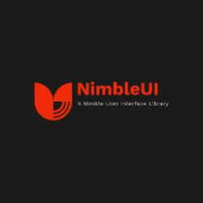

# NimbleUI - A Nimble User Interface Library



---

[](https://firstdonoharm.dev/version/3/0/full.html)

***:warning:** This library is still in early development! **Expect bugs!***

---

## Why Another DOM Library?
NimbleUI is a new kind of library out there. It is declarative like React; NimbleUI does use a virtual DOM, but the way it works is more efficient.

## Benefits of NimbleUI
1. NimbleUI is built to be fast and efficient because there very minimal virtual DOM diffing needed.
2. NimbleUI has zero dependencies - everything is home-grown.
3. There is no need for a compilation step unlike with React (JSX) or Svelte.

## How NimbleUI Works
NimbleUI has two parts:
- `Render` instructions are created by the core API; they are what dictate what the user can interact with.
- `Renderer`s are what do the rendering. This is currently done on the client but can also be done on the server. In the case of the client, renderers are what use the render instructions to tell the DOM how to behave.

## Basic Usage
### Installation

As of right now, NimbleUI is not on the NPM registry; the library will need to be installed from GitHub:

```ps1
> npm i -s git+https://github.com/IRod22/NimbleUI/tree/publish
```

### Hello, NimbleUI!

```js
import { e, t, attr } from 'nimble-ui'
import mount from 'nimble-ui/client'

const app = e('h1', [
    attr('class', () => 'title'),
    attr('style', () => 'color:green;'),
], [t('Hello, NimbleUI!')])

window.addEventListener('load', function () {
    mount(app, this.document.body)
})
```

## License: HL3
With the current turmoil going on, I decided to use the Hippocratic License 3.0 (HL3).
As an activist, I stand against the current status quo:
from wars, to company mal-practices, and to discrimination and abuses of any kind;
That is why I am choosing the HL3 as the license for NimbleUI.
Because of the HL3 is different than other FOSS licenses, I suggest you read the license carefully.

## Contributing to NimbleUI

Contributions are welcome, but it is greatly appreciated if you read the [Contributing Guidelines](CONTRIBUTING.md) first.

